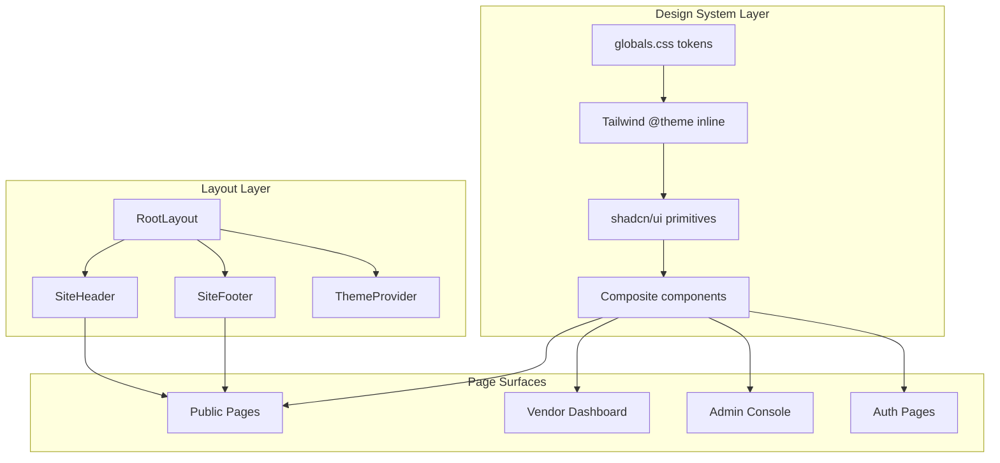
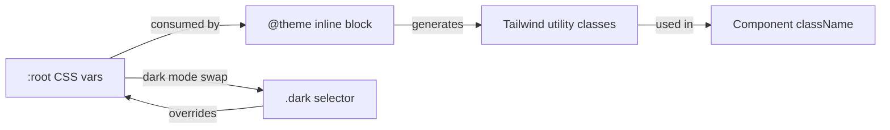

# Design Document: Elite UI Overhaul

## Overview

This design covers a full visual overhaul of the RentLeads (Carhire) platform, transitioning from the current orange-primary/mixed aesthetic to a premium navy-and-blue design system. The overhaul touches every surface — public pages, vendor dashboard, admin console, and auth flows — while preserving all existing functionality, routes, API endpoints, and business logic.

The core approach is:
1. **Token-first**: Redefine CSS custom properties and Tailwind theme tokens so existing shadcn/ui components automatically adopt the new palette
2. **Component enhancement**: Extend existing primitives (Button, Card, Input) with new variants rather than replacing them
3. **Page-by-page reskin**: Update each page's layout and content structure progressively, using the new tokens and enhanced components
4. **Zero regression**: Keep all route paths, API integrations, auth flows, form handlers, and database logic untouched

### Key Design Decisions

| Decision | Rationale |
|----------|-----------|
| Modify `globals.css` tokens in-place | Shadcn/ui and all existing components reference these tokens — changing them cascades the new palette everywhere |
| Keep `@base-ui/react` as Button primitive | Already integrated; no reason to swap |
| Use `next-themes` for dark mode | Already a dependency; no new runtime cost |
| No new animation library | Tailwind + CSS keyframes cover all requirements; keeps bundle lean |
| Shared `DashboardShell` for vendor + admin | Already exists; just needs token updates and responsive collapse |
| `lucide-react` only for icons | Per Requirement 13.1 — no new icon packages |

## Architecture

### System Diagram



### Token Cascade Architecture



The token system flows in one direction: CSS custom properties → Tailwind theme → component classes. Changing tokens at the root automatically propagates to every component using those tokens.

## Components and Interfaces

### Design System Tokens (`src/app/globals.css`)

**Color Tokens (Light Mode)**:
```
--primary: oklch(0.55 0.22 264)          /* #2563eb - Premium Blue */
--primary-foreground: oklch(0.985 0 0)    /* White */
--foreground: oklch(0.13 0.02 255)        /* #0f172a - Deep Navy */
--background: oklch(0.995 0 0)            /* #ffffff - White */
--card: oklch(1 0 0)                      /* Pure white cards */
--muted: oklch(0.97 0.005 265)            /* Slate-50 equivalent */
--muted-foreground: oklch(0.55 0.02 260)  /* Slate-500 */
--accent: oklch(0.97 0.01 264)            /* Light blue tint */
--border: oklch(0.91 0.005 260)           /* Slate-200 */
--destructive: oklch(0.57 0.24 27)        /* Red - unchanged */
```

**Color Tokens (Dark Mode)**:
```
--background: oklch(0.16 0.02 260)        /* #1e293b minimum */
--foreground: oklch(0.97 0 0)             /* Near-white text */
--card: oklch(0.20 0.02 260)              /* Slate-800 cards */
--primary: oklch(0.60 0.22 264)           /* Slightly lighter blue */
```

**Typography Tokens**:
```
--font-sans: "Inter", ui-sans-serif, system-ui, -apple-system, sans-serif
--font-heading: "Inter", ui-sans-serif, system-ui, -apple-system, sans-serif
Heading weights: 700 (h4-h6), 800 (h2-h3), 900 (h1)
Body weight: 400 (normal), 500 (medium)
Heading letter-spacing: -0.02em (h4-h6), -0.03em (h2-h3), -0.04em (h1)
```

**Spacing & Radius Tokens**:
```
Base unit: 4px
--radius: 0.75rem (12px base, lg)
--radius-sm: 6px
--radius-md: 8px
--radius-lg: 12px
--radius-xl: 16px

Shadows:
--shadow-sm: 0 1px 2px rgba(0,0,0,0.04)
--shadow-md: 0 4px 8px rgba(0,0,0,0.06)
--shadow-lg: 0 10px 24px rgba(0,0,0,0.08)
--shadow-xl: 0 20px 40px rgba(0,0,0,0.12)
```

### UI Primitive Enhancements

#### Button (`src/components/ui/button.tsx`)

Existing variants preserved. Add size adjustments to meet 44px touch targets:

```typescript
interface ButtonProps extends ButtonPrimitive.Props, VariantProps<typeof buttonVariants> {}

// Existing variants: default, outline, secondary, ghost, destructive, link
// Size additions:
//   "cta": h-11 (44px) gap-2 px-6 text-base font-bold rounded-lg
```

#### Card (`src/components/ui/card.tsx`)

Add `variant` prop:

```typescript
interface CardProps extends React.ComponentProps<"div"> {
  size?: "default" | "sm"
  variant?: "default" | "elevated" | "interactive"
}

// "elevated": shadow-md ring-0 (no border ring, shadow only)
// "interactive": shadow-sm hover:shadow-lg hover:-translate-y-1 transition-all cursor-pointer
```

#### Badge (`src/components/ui/badge.tsx`) — NEW

```typescript
interface BadgeProps extends React.ComponentProps<"span"> {
  variant?: "default" | "success" | "warning" | "destructive" | "info" | "outline"
}
```

#### Section (`src/components/ui/section.tsx`) — NEW

```typescript
interface SectionProps extends React.ComponentProps<"section"> {
  variant?: "default" | "muted" | "navy" | "gradient"
  size?: "sm" | "md" | "lg"
  container?: boolean // wraps in max-w-7xl mx-auto
}
```

#### Skeleton (`src/components/ui/skeleton.tsx`) — NEW

```typescript
interface SkeletonProps extends React.ComponentProps<"div"> {
  variant?: "text" | "circular" | "rectangular"
}
// Pulse animation: 40%-90% opacity over 1.5s
```

### Composite Components

| Component | Location | Purpose |
|-----------|----------|---------|
| `SiteHeader` | `src/components/site-header.tsx` | Sticky nav, white bg 85% opacity + blur, mobile drawer with focus trap |
| `SiteFooter` | `src/components/site-footer.tsx` | Navy bg, link columns, social links, copyright |
| `DashboardShell` | `src/components/dashboard-shell.tsx` | Shared sidebar shell for vendor + admin |
| `PricingTable` | `src/components/pricing-table.tsx` | 3-tier pricing with toggle, feature lists |
| `VehicleCard` | `src/components/vehicle-card.tsx` | Search result card with image, info, CTA |
| `MetricCard` | `src/components/metric-card.tsx` | Dashboard stat with label, value, trend |
| `SearchWidget` | `src/components/search-widget.tsx` | Hero search form with location input |
| `FilterSidebar` | `src/components/filter-sidebar.tsx` | Search filter panel with responsive toggle |
| `EmptyState` | `src/components/empty-state.tsx` — NEW | Icon + message + CTA for zero-item lists |
| `ErrorState` | `src/components/error-state.tsx` — NEW | Error message + retry + home link |
| `DataTable` | `src/components/data-table.tsx` — NEW | Sortable, paginated table with alternating rows |

### File Organization

```
src/
├── app/
│   ├── globals.css                    ← Token overhaul here
│   ├── layout.tsx                     ← ThemeProvider wrapper
│   ├── page.tsx                       ← Landing page redesign
│   ├── not-found.tsx                  ← 404 page (new)
│   ├── (public)/
│   │   ├── pricing/page.tsx           ← 3-tier pricing table
│   │   ├── search/page.tsx            ← Grid + filters + pagination
│   │   ├── cars/[slug]/page.tsx       ← Two-column detail
│   │   ├── vendors/[slug]/page.tsx    ← Profile + reviews
│   │   └── ...
│   ├── auth/
│   │   └── sign-in/page.tsx           ← Split layout auth
│   ├── vendor/
│   │   ├── layout.tsx                 ← Uses DashboardShell mode="vendor"
│   │   └── ...
│   └── admin/
│       ├── layout.tsx                 ← Uses DashboardShell mode="admin"
│       └── ...
├── components/
│   ├── ui/                            ← Shadcn primitives (enhanced)
│   │   ├── button.tsx
│   │   ├── card.tsx
│   │   ├── badge.tsx                  ← New
│   │   ├── section.tsx                ← New
│   │   ├── skeleton.tsx               ← New
│   │   ├── input.tsx
│   │   ├── label.tsx
│   │   ├── dialog.tsx
│   │   ├── textarea.tsx
│   │   └── sonner.tsx
│   ├── site-header.tsx                ← Restyled
│   ├── site-footer.tsx                ← Restyled
│   ├── dashboard-shell.tsx            ← Enhanced with responsive collapse
│   ├── pricing-table.tsx              ← New/rewritten
│   ├── vehicle-card.tsx               ← Restyled
│   ├── metric-card.tsx                ← Restyled
│   ├── data-table.tsx                 ← New
│   ├── empty-state.tsx                ← New
│   ├── error-state.tsx                ← New
│   └── ...existing components
└── lib/
    └── utils.ts                       ← cn() helper (unchanged)
```

### Page Implementation Approach

#### Landing Page (`src/app/page.tsx`)

Section order (top to bottom):
1. **Hero**: Full-width light gradient bg, bold headline (48px mobile / 72px desktop, weight 900), subtitle ≤120 chars, SearchWidget
2. **Trust Signals Bar**: Verified vendor count, vehicle count, star rating, partner logos
3. **How It Works**: 3 numbered step cards on white bg
4. **Featured Vehicles**: Up to 6 VehicleCards in responsive grid (hidden if 0 vehicles)
5. **Popular Locations**: 3-8 LocationCards with city image, count, price
6. **Testimonials**: 2-6 TestimonialCards with quote, rating, name
7. **Vendor CTA**: Navy (#0f172a) bg, benefit bullets, primary CTA to sign-up

#### Pricing Page (`src/app/(public)/pricing/page.tsx`)

- Monthly/annual toggle (defaults monthly)
- 3 plan cards: Basic $29, Pro $79 (highlighted), Premium $179
- Annual = monthly × 12 × 0.8
- Feature inclusion/exclusion lists with check/x icons
- CTAs: "Start Free - [Plan]" → `/auth/sign-in?plan={id}`
- Microcopy: "14-day trial", "No credit card required", "Cancel anytime"
- Responsive: stacked <768px, side-by-side ≥768px

#### Search Page (`src/app/(public)/search/page.tsx`)

- Filter sidebar: visible ≥1024px, toggle <1024px
- Card grid: 1 col <768px, 2 cols 768-1279px, 3 cols ≥1280px
- Pagination: 20 per page, prev/next + page numbers
- Empty state: graphic + message + clear filters button
- Error state: message + retry button

#### Auth Pages (`src/app/auth/sign-in/page.tsx`)

- Split layout ≥1024px: left panel (value prop) + right (form card)
- Single column <1024px: form card only
- Light gradient bg, centered card max-w-768px
- Loading state: spinner on submit, all inputs disabled
- Error state: inline destructive-colored message

#### Dashboard (`src/components/dashboard-shell.tsx`)

- Sidebar: 260px fixed desktop, collapsed drawer/tab bar <768px
- Nav items: icon + label, 44px min height, primary blue active state
- Metric cards: elevated variant, uppercase 13px label, 36px value, trend arrow
- Tables: alternating row tint, sortable headers, 10 rows/page default
- Skeleton loaders for loading states, error state with retry for failures

### Key Implementation Patterns

**1. Token Migration (non-breaking)**:
Change CSS custom properties in `:root` — all components using `bg-primary`, `text-foreground`, etc. automatically get the new colors. No component file changes needed for basic color swap.

**2. Dark Mode**:
Already have `.dark` selector in globals.css and `next-themes` installed. Update dark palette values to use backgrounds ≥ #1e293b. Verify contrast ratios ≥ 4.5:1 text / 3:1 UI.

**3. Responsive Pattern**:
Mobile-first: default styles target mobile. Use `sm:`, `md:`, `lg:`, `xl:` prefixes for progressively larger viewports. This matches Tailwind 4's default behavior.

**4. Focus Management (Mobile Drawer)**:
Use `inert` attribute on main content when drawer is open. Trap focus within drawer using event listener on keydown Tab. Move focus to first focusable element on open, return focus to trigger on close.

**5. Scroll-triggered Header**:
Already implemented in `SiteHeader` — update threshold from 10px to 80px, add box-shadow, switch from glassmorphism to solid white `bg-white` at full opacity.

**6. Performance Budget**:
- No new runtime deps > 50KB gzipped
- Images via `next/image` with explicit dimensions
- Priority loading for above-fold content (`priority` prop)
- Code-split heavy sections (testimonials, featured vehicles) with dynamic imports if needed

## Data Models

No database schema changes required. This is a pure UI overhaul. All existing data models, Supabase tables, RLS policies, and API contracts remain unchanged.

**Data interfaces consumed by UI components** (already exist in codebase):

```typescript
// Vehicle data shape (from Supabase)
interface Vehicle {
  id: string
  name: string
  slug: string
  category: string
  price_per_day: number
  image_url: string | null
  vendor_name: string
  vendor_slug: string
  location_city: string
  seats: number
  fuel_type: string
  transmission: string
  branch_location: string
}

// Vendor profile shape
interface VendorProfile {
  id: string
  name: string
  slug: string
  logo_url: string | null
  is_verified: boolean
  city: string
  state: string
  vehicle_count: number
  avg_rating: number | null
  review_count: number
  description: string | null
}

// Pricing plan shape (static data)
interface PricingPlan {
  id: "basic" | "pro" | "premium"
  name: string
  monthlyPrice: number      // in AUD
  vehicleLimit: number | null  // null = unlimited
  features: PlanFeature[]
  badge?: string             // "Most Popular - Best Value"
}

interface PlanFeature {
  label: string
  included: boolean
}
```

## Correctness Properties

*A property is a characteristic or behavior that should hold true across all valid executions of a system — essentially, a formal statement about what the system should do. Properties serve as the bridge between human-readable specifications and machine-verifiable correctness guarantees.*

### Property 1: UI Primitive Rendering Resilience

*For any* exported UI primitive (Button, Card, Badge, Input, Section, Skeleton) and *for any* valid combination of its declared props, rendering the component SHALL succeed without throwing an error and SHALL produce at least one DOM element.

**Validates: Requirements 1.4, 1.6**

### Property 2: Annual Billing Discount Calculation

*For any* monthly plan price (positive number), the displayed annual price SHALL equal `monthlyPrice × 12 × 0.8`, rounded to two decimal places.

**Validates: Requirements 4.4**

### Property 3: VehicleCard Field Completeness

*For any* valid Vehicle object (with non-null required fields), rendering a VehicleCard SHALL produce output containing the vehicle name, category, price per day, vendor name, location, and a call-to-action link to the vehicle detail page.

**Validates: Requirements 5.5**

### Property 4: Pagination Correctness

*For any* total result count and page size of 20, the pagination component SHALL display `ceil(totalCount / 20)` total pages, and the current page indicator SHALL always be between 1 and the total page count inclusive.

**Validates: Requirements 5.7**

### Property 5: Vendor Profile Field Completeness

*For any* valid VendorProfile object, rendering the vendor profile header SHALL produce output containing the vendor name, location (city and state), vehicle count, and average rating (when non-null).

**Validates: Requirements 6.1**

### Property 6: Vendor Vehicle Display Cap

*For any* vendor with N approved vehicles where N ≥ 0, the vendor profile page SHALL display exactly `min(N, 12)` vehicle cards. When N > 12, a "View all" link SHALL be present.

**Validates: Requirements 6.2, 6.3**

### Property 7: Data Table Sort Ordering

*For any* data table with N rows and *for any* sortable column, when sort is applied in ascending order, each row's value for that column SHALL be ≤ the next row's value. When sort is applied in descending order, each row's value SHALL be ≥ the next row's value.

**Validates: Requirements 8.3, 9.3**

### Property 8: Empty State Display for Zero-Item Collections

*For any* list or grid component rendered with zero items, the component SHALL render an empty state containing an icon element, a descriptive message, and a CTA element (button or link).

**Validates: Requirements 12.3**

## Error Handling

### Error Boundary Strategy

| Layer | Approach | Fallback |
|-------|----------|----------|
| Page-level | Next.js `error.tsx` boundary per route group | ErrorState component with retry + home link |
| Component-level | Try/catch in data fetching, loading/error state management | Inline ErrorState within content area |
| API failures | Catch in server actions / fetch calls | Display error message with retry button |
| 404 | Next.js `not-found.tsx` | Custom styled not-found page with search + home links |

### Specific Error Scenarios

1. **Search API failure**: Show ErrorState with "Search could not be completed" message and "Retry" button that re-initiates the fetch
2. **Dashboard data load failure**: Show ErrorState within the content area (sidebar remains functional)
3. **Auth error**: Inline destructive-colored message above form inputs with specific error text and corrective action
4. **Image load failure**: `next/image` fallback to placeholder via `onError` handler
5. **Consecutive retry failure (Req 12.5)**: Error state persists with retry button still enabled — no state machine escalation

### Loading States

All data-fetching pages use skeleton loaders matching content dimensions:
- Card grids: skeleton rectangles matching card aspect ratio
- Tables: skeleton rows with column-width blocks
- Metric cards: skeleton circles for icons, skeleton lines for values
- Pulse animation: opacity oscillates 40% → 90% over 1.5s duration

## Testing Strategy

### Unit Tests (Vitest + React Testing Library)

Focus areas:
- Component rendering with various prop combinations
- Responsive behavior assertions (using container queries or mocked viewport)
- Interaction tests (toggle, click, keyboard navigation)
- Edge cases: empty data, error states, boundary values

### Property-Based Tests (fast-check + Vitest)

Library: **fast-check** — mature, TypeScript-native, integrates with Vitest.

Configuration:
- Minimum 100 iterations per property test
- Each test tagged with: `// Feature: elite-ui-overhaul, Property N: [property text]`

Property tests to implement:
1. UI primitive rendering (generate random valid prop objects for each component)
2. Annual discount calculation (generate random prices, verify formula)
3. VehicleCard completeness (generate random Vehicle objects)
4. Pagination math (generate random total counts)
5. Vendor profile completeness (generate random VendorProfile objects)
6. Vendor vehicle cap (generate random vehicle counts 0-100)
7. Data table sorting (generate random data arrays + sort columns)
8. Empty state presence (render list components with empty arrays)

### Integration Tests

- `next build` succeeds without errors (CI gate)
- All existing automated tests pass without modification
- Lighthouse CI for performance scores (≥90 mobile)
- Bundle size checks (≤200KB JS per route, no new dep >50KB gzipped)

### Visual Regression (Optional/Future)

- Playwright screenshot comparisons for key pages at 3 breakpoints (375px, 768px, 1440px)
- Captures token changes and layout shifts

### CI Pipeline Requirements

On PRs modifying `src/components/ui/**`, `src/app/globals.css`, or `src/app/(public)/**`:
1. `eslint` — pass
2. `tsc --noEmit` — pass
3. `vitest run` — pass (includes property tests)
4. `next build` — pass
