# Design Document: Mobile Optimisation

## Overview

This design document describes the technical approach for mobile-optimising the HireCar Marketplace. The existing codebase is a Next.js 16 App Router application with Tailwind CSS v4, shadcn/ui, and framer-motion. The site has basic responsive breakpoints but lacks dedicated mobile-first patterns for touch gestures, viewport handling, performance, and native-feeling UX.

The design focuses on pragmatic modifications to existing components and the introduction of targeted new utilities/hooks rather than a rewrite. Changes are grouped into: gesture handling, navigation overhaul, form improvements, viewport/safe-area handling, performance, typography, search UX, vehicle detail optimisation, PWA foundations, animation governance, accessibility, z-index management, dynamic header spacing, landscape support, and scroll indicators.

## Architecture

The mobile optimisation layer sits within the existing Next.js App Router architecture. No new routing or data-fetching patterns are required. Changes are primarily at the component and CSS layer.

```mermaid
graph TD
    A[Root Layout - layout.tsx] --> B[Safe Area Meta + CSS Variables]
    A --> C[Service Worker Registration]
    A --> D[WhatsAppFloat - context-aware positioning]
    
    E[Site Header] --> F[useHeaderHeight hook]
    F --> G[CSS Variable --header-height]
    
    H[Mobile Navigation] --> I[Slide-in Drawer + Focus Trap]
    H --> J[Swipe-to-close gesture]
    
    K[Image Gallery] --> L[useSwipeGesture hook]
    K --> M[usePinchZoom hook]
    K --> N[Pagination Dots]
    
    O[Search Page] --> P[Bottom Sheet Filter]
    O --> Q[Filter Chips]
    O --> R[Floating Filter FAB - existing]
    
    S[Vehicle Detail] --> T[Sticky CTA - safe area aware]
    S --> U[ScrollIndicator component]
    
    V[globals.css] --> W[Z-Index Scale Tokens]
    V --> X[Fluid Typography Scale]
    V --> Y[Touch Target Utilities]
    V --> Z[Safe Area Utilities]
```



### Key Architectural Decisions

1. **Hooks over libraries for gestures**: Use lightweight custom hooks (`useSwipeGesture`, `usePinchZoom`) built on native PointerEvents/TouchEvents rather than adding a heavyweight gesture library. framer-motion's drag API can supplement where needed.

2. **CSS-first for layout**: Safe areas, typography scaling, touch targets, and spacing changes are all handled in Tailwind CSS v4 utilities and `globals.css` tokens. No runtime JS for these concerns.

3. **ResizeObserver for dynamic header**: Replace the hardcoded `h-[116px]` spacer with a `useHeaderHeight` hook that uses ResizeObserver and a CSS variable.

4. **Progressive Enhancement for PWA**: Service worker and manifest are additive — the site works fully without them. next-pwa or a custom SW script registered in layout.tsx.

5. **Framer-motion governance**: A `MobileAnimationProvider` context limits concurrent animations and respects `prefers-reduced-motion`.

## Components and Interfaces

### New Components

| Component | Path | Purpose |
|-----------|------|---------|
| `MobileDrawerNav` | `src/components/mobile-drawer-nav.tsx` | Right-slide drawer with backdrop, focus trap, swipe-to-close |
| `ScrollIndicator` | `src/components/scroll-indicator.tsx` | Gradient fades on horizontally scrollable containers |
| `ScrollToTop` | `src/components/scroll-to-top.tsx` | Floating scroll-to-top button after 2vh scroll |
| `FilterChips` | `src/components/filter-chips.tsx` | Dismissible chip row showing active search filters |
| `PaginationDots` | `src/components/pagination-dots.tsx` | Dot indicators for image gallery |
| `OfflineFallback` | `src/app/offline/page.tsx` | Offline fallback page with retry button |
| `A2HSBanner` | `src/components/a2hs-banner.tsx` | Add to Home Screen prompt banner |

### New Hooks

| Hook | Path | Purpose |
|------|------|---------|
| `useSwipeGesture` | `src/hooks/use-swipe-gesture.ts` | Detect horizontal/vertical swipe on a ref element |
| `usePinchZoom` | `src/hooks/use-pinch-zoom.ts` | Pinch-to-zoom with clamped scale factor |
| `useHeaderHeight` | `src/hooks/use-header-height.ts` | ResizeObserver-based header height tracking + CSS var |
| `useScrollIndicator` | `src/hooks/use-scroll-indicator.ts` | Track scroll position for gradient indicator visibility |
| `useScrollPosition` | `src/hooks/use-scroll-position.ts` | Track page scroll position for scroll-to-top |
| `useReducedMotion` | `src/hooks/use-reduced-motion.ts` | Read prefers-reduced-motion media query |
| `useBodyScrollLock` | `src/hooks/use-body-scroll-lock.ts` | Lock/unlock body scroll for overlays |

### Modified Components

| Component | Changes |
|-----------|---------|
| `site-header.tsx` | Replace hardcoded spacer with `useHeaderHeight`; add `env(safe-area-inset-top)` padding; update z-index to z-40; refactor mobile menu to use `MobileDrawerNav` |
| `whatsapp-float.tsx` | Accept `stickyCtaVisible` prop; reposition when CTA visible; hide when overlay open; update z-index to z-50 |
| `image-gallery.tsx` | Add swipe gesture support; add pinch-to-zoom; replace arrow buttons with `PaginationDots` on mobile; hide arrows on mobile |
| `vehicle-card.tsx` | Ensure all interactive areas meet 44x44px touch targets |
| `cars/[slug]/page.tsx` | Add `ScrollIndicator` to breadcrumb; update sticky CTA with safe-area padding; wrap gallery in gesture-aware container |
| `search/page.tsx` | Add `FilterChips` above results; update filter panel to bottom-sheet on mobile; ensure search button in lower half |
| `layout.tsx` | Add viewport-fit=cover to metadata; register service worker; add web app manifest link |
| `globals.css` | Add z-index scale tokens, fluid type scale, touch-target utilities, safe-area utilities, landscape media queries |

### Interface Definitions

```typescript
// useSwipeGesture
interface SwipeGestureOptions {
  threshold?: number; // minimum px distance to trigger (default: 50)
  onSwipeLeft?: () => void;
  onSwipeRight?: () => void;
  onSwipeUp?: () => void;
  onSwipeDown?: () => void;
}
function useSwipeGesture(ref: RefObject<HTMLElement>, options: SwipeGestureOptions): void;

// usePinchZoom
interface PinchZoomState {
  scale: number;
  origin: { x: number; y: number };
}
interface PinchZoomOptions {
  minScale?: number; // default: 1
  maxScale?: number; // default: 3
}
function usePinchZoom(ref: RefObject<HTMLElement>, options?: PinchZoomOptions): PinchZoomState;

// useHeaderHeight
function useHeaderHeight(headerRef: RefObject<HTMLElement>): number;

// useScrollIndicator
interface ScrollIndicatorState {
  showLeading: boolean;
  showTrailing: boolean;
}
function useScrollIndicator(containerRef: RefObject<HTMLElement>): ScrollIndicatorState;

// useScrollPosition
function useScrollPosition(): number; // returns window.scrollY

// ScrollIndicator component
interface ScrollIndicatorProps {
  children: React.ReactNode;
  className?: string;
  gradientColor?: string; // default: "white"
}
```

## Data Models

No new database tables or API endpoints are required. All changes are client-side UI and rendering optimisations.

### New Static Files

| File | Purpose |
|------|---------|
| `public/manifest.json` | Web app manifest for PWA |
| `public/sw.js` | Service worker script |
| `public/offline.html` | Static offline fallback (served by SW) |
| `public/icons/icon-192.png` | PWA icon 192x192 |
| `public/icons/icon-512.png` | PWA icon 512x512 |

### CSS Token Additions (globals.css)

```css
:root {
  /* Z-Index Scale */
  --z-header: 40;
  --z-sticky-cta: 50;
  --z-whatsapp: 50;
  --z-mobile-nav: 60;
  --z-modal: 70;

  /* Header Height (dynamically set by JS) */
  --header-height: 116px; /* fallback */

  /* Touch Target */
  --touch-min: 44px;
  --touch-gap: 8px;
}
```

### Service Worker Caching Strategy

| Route Pattern | Strategy | TTL |
|---------------|----------|-----|
| Static assets (CSS, JS, fonts) | Cache-first | Indefinite (versioned) |
| Homepage (`/`) | Stale-while-revalidate | 1 hour |
| Vehicle listings (`/search`, `/locations/*`) | Stale-while-revalidate | 30 minutes |
| Images | Cache-first | 7 days |
| API calls | Network-first | N/A |

## Correctness Properties

*A property is a characteristic or behavior that should hold true across all valid executions of a system — essentially, a formal statement about what the system should do. Properties serve as the bridge between human-readable specifications and machine-verifiable correctness guarantees.*

### Property 1: Gallery index navigation wraps correctly

*For any* image gallery with N images (N ≥ 1) and any current index I (0 ≤ I < N), swiping left should produce index `(I + 1) % N` and swiping right should produce index `(I - 1 + N) % N`.

**Validates: Requirements 2.1**

### Property 2: Pinch zoom scale is proportional and clamped

*For any* pinch distance delta, the computed zoom scale should be proportional to the delta and clamped within `[minScale, maxScale]` bounds (default [1, 3]). Specifically: `minScale ≤ computedScale ≤ maxScale` for all inputs.

**Validates: Requirements 2.2**

### Property 3: Active filters produce correct UI state

*For any* set of active filters (0 to N filters active), the filter chip row should render exactly one chip per active filter, and the floating filter button badge should display the count equal to the number of active filters.

**Validates: Requirements 8.3, 8.4**

### Property 4: Scroll indicator visibility reflects scroll position

*For any* scrollable container with `scrollWidth > clientWidth`, given a scroll position `scrollLeft`: the leading gradient is visible iff `scrollLeft > 0`, and the trailing gradient is visible iff `scrollLeft + clientWidth < scrollWidth`.

**Validates: Requirements 9.5, 16.1, 16.2, 16.3**

### Property 5: WhatsApp button repositions above sticky CTA

*For any* sticky CTA bar height H (H > 0), when the CTA is visible on mobile, the WhatsApp button's bottom offset should equal `H + 12px + base_offset` where base_offset is the default bottom spacing (24px).

**Validates: Requirements 13.2**

### Property 6: Header spacer synchronises with header height

*For any* rendered header height H (measured via offsetHeight), the spacer element's height and the CSS variable `--header-height` should both equal H.

**Validates: Requirements 14.1, 14.2, 14.3**

### Property 7: Scroll-to-top button visibility threshold

*For any* page scroll position `scrollY` and viewport height `vh`, the scroll-to-top button should be visible iff `scrollY > 2 * vh`.

**Validates: Requirements 16.4**

## Error Handling

| Scenario | Handling |
|----------|----------|
| Service worker registration fails | Silently fail — site works without SW. Log to console. |
| Network request fails (SW active) | Serve offline fallback page with retry button. |
| Image gallery has 0 images | Show placeholder icon (existing behaviour). Swipe gestures are no-ops. |
| Pinch zoom on non-touch device | No-op — hook only activates on touch events. |
| ResizeObserver not supported | Fall back to hardcoded header height (existing 116px). |
| Manifest fetch fails | PWA features degrade gracefully — no install prompt. |
| prefers-reduced-motion detection | Default to reduced motion if matchMedia unavailable. |
| Focus trap with no focusable elements | Trap exits gracefully; menu can still be closed via backdrop/swipe. |

## Testing Strategy

### Property-Based Tests (fast-check)

The project already uses `fast-check` (v4.8.0) and `vitest` (v4.1.7). Property tests will be placed in `src/__tests__/properties/` directory.

Each property test runs a minimum of **100 iterations** and is tagged with a comment referencing the design property.

**Library**: fast-check (already installed)
**Runner**: vitest --run
**Tag format**: `Feature: mobile-optimisation, Property {N}: {title}`

Tests to write:
1. `gallery-navigation.property.test.ts` — Property 1
2. `pinch-zoom-scale.property.test.ts` — Property 2
3. `filter-ui-state.property.test.ts` — Property 3
4. `scroll-indicator.property.test.ts` — Property 4
5. `whatsapp-reposition.property.test.ts` — Property 5
6. `header-spacer.property.test.ts` — Property 6
7. `scroll-to-top.property.test.ts` — Property 7

### Unit Tests (example-based)

- Mobile drawer nav: opens/closes, focus trap, backdrop dismiss, swipe-to-close
- Form inputs: inputMode attributes, autocomplete attributes, font-size ≥ 16px
- ARIA attributes on navigation toggle
- Z-index values match defined scale
- Reduced motion hook returns correct value
- Offline fallback page renders with retry button

### Integration Tests (Playwright)

- Touch target sizing (44x44px) across key interactive elements
- LCP / CLS performance budgets via Lighthouse CI
- Colour contrast ratios via axe-core
- No horizontal overflow on all public pages at 375px width
- Service worker registration and offline fallback
- Safe area rendering on iPhone simulator

### Manual Testing Checklist

- iOS Safari: no input zoom, safe areas respected, smooth scrolling
- Android Chrome: gestures work, PWA install prompt appears
- Landscape orientation: layout adapts without reload
- Screen reader: navigation announcements, focus management
- Slow 3G: pages load within acceptable timeframes
