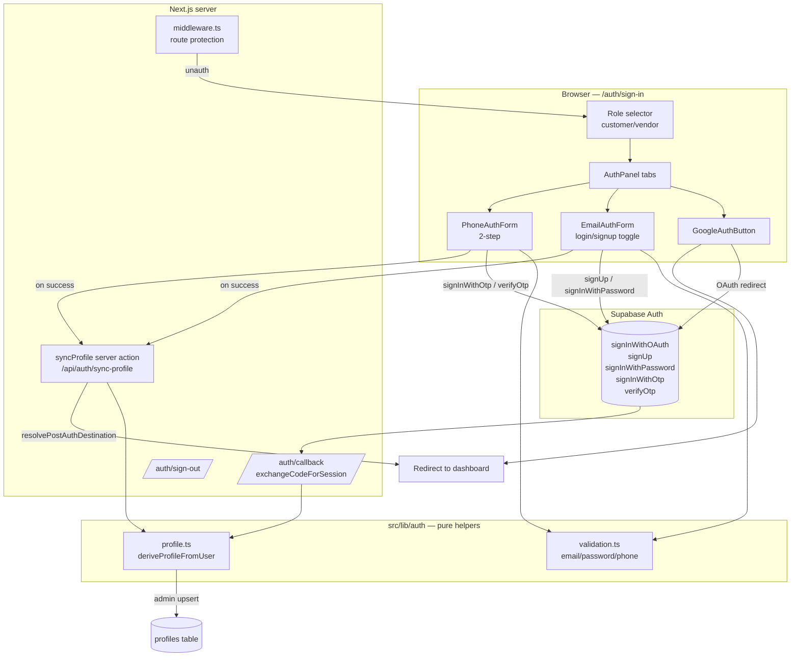

# Design Document: multi-method-auth

## Overview

This design adds two authentication methods — email + password and phone OTP — alongside the existing Google OAuth flow, with all three delegating entirely to Supabase Auth. The work reuses the project's existing Supabase client factories, redirect-safety helpers, profile-sync pattern, and middleware route protection. No custom credential store, password hashing, or session machinery is introduced.

The design follows three principles drawn from the codebase and the Next.js 16 guidance:

1. **Supabase is the single source of truth.** Sign-in/sign-up operations call `signInWithOAuth`, `signUp`, `signInWithPassword`, `signInWithOtp`, and `verifyOtp` on the Supabase clients. Sessions live in SSR cookies managed by `@supabase/ssr`, exactly as today.
2. **Shared, pure logic.** Input validation (email, password policy, phone format) and profile-field derivation are extracted into small, typed, pure functions so they can be unit- and property-tested in isolation and reused across all three flows.
3. **Preserve current behavior.** Role selection (`customer`/`vendor`), the `/auth/callback` code exchange, `resolvePostAuthDestination`, `/auth/sign-out`, and `middleware.ts` protection remain the backbone. The Google flow's observable behavior does not change.

### Research findings that shaped the design

- **Supabase clients** already exist: `createClient()` (browser) in `src/lib/supabase/client.ts`, `createClient()` (server, async, cookie-bound) in `src/lib/supabase/server.ts`, and `createAdminClient()` (service role) in `src/lib/supabase/admin.ts`. The browser client uses `NEXT_PUBLIC_SUPABASE_URL` + `NEXT_PUBLIC_SUPABASE_PUBLISHABLE_KEY`; the service key is server-only.
- **Profile sync today** happens only in `/auth/callback/route.ts` using the admin client to `upsert` into `profiles`. The `profiles` table has columns `id, full_name, email, phone, created_at, updated_at` and **no `avatar_url` column**. RLS exposes SELECT (own/admin) and UPDATE (own) but **no INSERT policy** — inserts succeed only because the admin (service-role) client bypasses RLS.
- **Redirect safety** is centralized in `src/lib/routing.ts` (`isSafeRedirectPath`, `resolvePostAuthDestination`, `isValidRedirectForRole`). These reject `//`, absolute URLs, and any path containing `:`.
- **Next.js 16** route handlers use Web `Request`/`Response`; `cookies()` from `next/headers` is async. The existing routes already follow these conventions, so new server code will match.
- **Testing** uses Vitest + fast-check with property tests under `src/__tests__/properties/`. UI is shadcn (`base-nova`) + Tailwind v4 with `Button`, `Card`, etc.

## Architecture



### Flow summary

- **Google (unchanged):** role select → `signInWithOAuth({provider:'google', redirectTo:/auth/callback?next&role&plan})` → callback exchanges code → `deriveProfileFromUser` + admin upsert → redirect via `resolvePostAuthDestination`.
- **Email/password:** validate client-side → `signUp` or `signInWithPassword` (browser client sets session cookies) → on active session, call `syncProfile` server action → redirect via `resolvePostAuthDestination`. If email confirmation is required (no session returned), show "check your email" instead of redirecting.
- **Phone OTP:** validate E.164 → `signInWithOtp({phone})` → step 2 code entry → `verifyOtp({phone, token, type:'sms'})` (session cookies set) → `syncProfile` → redirect.

`syncProfile` is a new server action/route that reads the now-authenticated user from the **server** client (cookies present after sign-in) and upserts via the **admin** client, reusing the exact derivation logic the callback uses. This keeps profile creation consistent for the password/OTP flows, which never pass through `/auth/callback`.

## Components and Interfaces

### New shared library: `src/lib/auth/validation.ts`

Pure, typed validators returning structured results (no exceptions, UI-consumable). Used by the email and phone forms before any Supabase call.

```ts
export type ValidationResult =
  | { ok: true }
  | { ok: false; message: string };

/** RFC-pragmatic email check; trims input first. */
export function validateEmail(input: string): ValidationResult;

/** Password policy: min length and composition (documented constants). */
export function validatePassword(input: string): ValidationResult;

/** Confirm-password equality check. */
export function validatePasswordConfirmation(
  password: string,
  confirm: string,
): ValidationResult;

/** E.164 international format: '+' followed by 8–15 digits, leading digit 1–9. */
export function validatePhone(input: string): ValidationResult;
```

### New shared library: `src/lib/auth/profile.ts`

```ts
import type { User } from "@supabase/supabase-js";

export interface ProfileUpsert {
  id: string;
  email: string | null;
  phone: string | null;
  full_name: string | null;
  avatar_url: string | null;
  updated_at: string;
}

/** Pure: maps a Supabase user to the profiles upsert payload with null-safe fallbacks. */
export function deriveProfileFromUser(user: User): ProfileUpsert;
```

Derivation rules:
- `id` = `user.id`.
- `email` = `user.email ?? null` (phone-only users have no email).
- `phone` = `user.phone ?? null` (Google/email users have no phone).
- `full_name` = `user.user_metadata.full_name ?? user.user_metadata.name ?? null`.
- `avatar_url` = `user.user_metadata.avatar_url ?? user.user_metadata.picture ?? null`.
- `updated_at` = current ISO timestamp.

### New server action: `syncProfile` (`src/app/actions/auth-sync.ts`)

```ts
"use server";
/** Reads the authenticated user via the server client, upserts the profile via the admin client. */
export async function syncProfile(): Promise<{ ok: boolean }>;
```

- Calls `createClient()` (server) → `auth.getUser()`. If no user, returns `{ ok: false }` (no upsert).
- Calls `deriveProfileFromUser(user)` and `createAdminClient().from("profiles").upsert(payload)`.
- The `/auth/callback` route is refactored to call `deriveProfileFromUser` + the same upsert helper, removing duplicated mapping logic (welcome-email behavior preserved).

### UI components: `src/components/auth/`

All client components, shadcn + Tailwind, small and typed.

- **`AuthPanel.tsx`** — tabbed container ("Google", "Email", "Phone"); owns the selected `Auth_Role` and shared `error` rendering; passes `resolveNextRoute(role)` to children.
- **`GoogleAuthButton.tsx`** — the existing `signInWithOAuth` logic extracted verbatim (behavior preserved).
- **`EmailAuthForm.tsx`** — login/signup toggle; runs `validateEmail`/`validatePassword`/`validatePasswordConfirmation`; calls `signUp` or `signInWithPassword`; handles the email-confirmation (no-session) branch; disables only its own submit button while pending.
- **`PhoneAuthForm.tsx`** — two-step (phone entry → code entry); runs `validatePhone`; calls `signInWithOtp` then `verifyOtp`; shows success state on code sent; disables only its own active control.
- **`useAuthRedirect.ts`** (hook) — wraps `syncProfile()` + client navigation to `resolveNextRoute(role)` after a session is established, shared by email and phone forms.

`src/app/auth/sign-in/page.tsx` is updated to render `<AuthPanel>` while keeping the role-selection UX and the `redirectedFrom`/`plan`/`mfa-required` query handling already present.

### Reused interfaces (unchanged)

- `src/lib/routing.ts`: `resolvePostAuthDestination`, `isSafeRedirectPath`, `isValidRedirectForRole`, `defaultDashboardForRole`.
- `src/lib/supabase/{client,server,admin}.ts`: client factories.
- `middleware.ts`: protection for `/customer`, `/vendor`, `/messages`, `/admin`.
- `/auth/sign-out/route.ts`: `signOut` + cookie cleanup.

## Data Models

### `profiles` table (existing + one additive column)

| Column | Type | Notes |
| --- | --- | --- |
| `id` | uuid (PK → auth.users) | Supabase user id |
| `full_name` | text, nullable | from Google metadata when present |
| `email` | text, nullable | null for phone-only users |
| `phone` | text, nullable | null for Google/email users |
| `avatar_url` | text, nullable | **new** — from Google metadata when present |
| `created_at` | timestamptz | unchanged |
| `updated_at` | timestamptz | set on every upsert |

Forward migration `supabase/migrations/<ts>_profiles_add_avatar_url.sql`:

```sql
alter table public.profiles add column if not exists avatar_url text;
```

No RLS policy change is required: profile upserts run through the service-role admin client, which bypasses RLS, and the additive nullable column does not affect the existing "read own or admin" / "update own" policies. (If a future client-side read of `avatar_url` is added, it is already covered by the existing SELECT policy.)

### `ValidationResult`

Discriminated union `{ ok: true } | { ok: false; message: string }` — UI maps `message` directly to field/error text.

### `ProfileUpsert`

The pure payload produced by `deriveProfileFromUser` (see above), matching the `profiles` columns with null-safe fields.

### Session model (unchanged)

Supabase SSR session stored in cookies, read by the browser client, the server client, and `middleware.ts`. All three auth methods produce this same session shape.

## Correctness Properties

*A property is a characteristic or behavior that should hold true across all valid executions of a system — essentially, a formal statement about what the system should do. Properties serve as the bridge between human-readable specifications and machine-verifiable correctness guarantees.*

The testable core of this feature is its pure logic: input validation, profile-field derivation, and redirect safety. UI wiring and Supabase service behavior are covered by example/integration tests (see Testing Strategy), not properties.

After prework analysis and property reflection, the testable properties collapse into six: four independent input-validator properties (each over a distinct pure function), one comprehensive profile-derivation property, and one comprehensive redirect-safety property shared by all three auth methods.

### Property 1: Email validation accepts well-formed and rejects malformed addresses

*For any* input string, `validateEmail` returns `{ ok: true }` if and only if the trimmed string is a well-formed email address (a non-empty local part, a single `@`, and a domain with at least one dot and no whitespace), and otherwise returns `{ ok: false }` with a message.

**Validates: Requirements 2.3, 8.6, 10.3**

### Property 2: Password validation enforces the documented policy

*For any* input string, `validatePassword` returns `{ ok: true }` if and only if the string satisfies the documented password policy (minimum length and required composition), and otherwise returns `{ ok: false }` with a message.

**Validates: Requirements 2.4, 8.6, 10.3**

### Property 3: Password confirmation matches exactly

*For any* pair of strings `(password, confirm)`, `validatePasswordConfirmation(password, confirm)` returns `{ ok: true }` if and only if `password === confirm`.

**Validates: Requirements 2.2, 8.6, 10.3**

### Property 4: Phone validation accepts only E.164 international format

*For any* input string, `validatePhone` returns `{ ok: true }` if and only if the string is in E.164 international format (a leading `+`, a first digit 1–9, and a total of 8–15 digits), and otherwise returns `{ ok: false }` with a message.

**Validates: Requirements 4.2, 8.6, 10.3**

### Property 5: Profile derivation is total and null-safe across all user shapes

*For any* Supabase user, `deriveProfileFromUser(user)` produces a payload where `id` equals `user.id`, `email` equals the user's email or `null` when absent, `phone` equals the user's phone or `null` when absent, `full_name` and `avatar_url` are derived from user metadata when present or `null` otherwise, and `updated_at` is a valid ISO-8601 timestamp — without throwing for any user that lacks an email or a phone.

**Validates: Requirements 7.1, 7.2, 7.3, 7.4, 7.5, 7.6, 7.7, 7.8, 11.3**

### Property 6: Post-login redirect resolution is always safe and consistent across methods

*For any* role (`customer`/`vendor`) and *any* candidate `next` string and `plan` value, `resolvePostAuthDestination` returns a safe same-origin relative path (as accepted by `isSafeRedirectPath`); when the candidate `next` is a safe role-valid path it is returned unchanged, and when it is unsafe or role-invalid the role-appropriate default destination is returned instead.

**Validates: Requirements 1.3, 1.5, 6.2, 6.3, 8.4, 11.2**

## Error Handling

| Scenario | Handling | Requirement |
| --- | --- | --- |
| Client-side validation failure (email/password/phone/confirm) | Show inline field message from `ValidationResult.message`; do not call Supabase | 2.2–2.4, 4.2, 8.6 |
| `signUp` returns no session (email confirmation enabled) | Show "check your email to confirm" message; do not redirect | 2.6 |
| `signUp` / `signInWithPassword` error | Map to a friendly sanitized message; never render the raw Supabase payload | 2.8, 3.4, 3.5, 8.5 |
| Invalid login credentials | Generic "invalid email or password" (no email-existence disclosure) | 3.4 |
| `signInWithOtp` provider/SMS-not-configured error | Friendly "phone sign-in temporarily unavailable" message; stay on phone-entry step | 4.3a, 4.8 |
| `verifyOtp` failure | Friendly message; keep code field editable for retry | 4.6 |
| OAuth `exchangeCodeForSession` failure | Redirect to `/auth/sign-in?error=auth_failed`; no detail leak | 1.4 |
| Unsafe / role-invalid redirect target | Fall back to role-appropriate default via `resolvePostAuthDestination` | 6.3, 8.4 |
| `syncProfile` finds no authenticated user | Return `{ ok: false }`; do not upsert; surface a generic error | 7.1 |
| Unauthenticated access to a Protected_Route | Middleware redirects to `/auth/sign-in?redirectedFrom=...`; default-deny if redirect cannot be issued | 6.4, 6.7 |

**Error-mapping helper:** a small `toFriendlyAuthError(error)` function centralizes mapping Supabase error shapes to user-safe strings, ensuring no raw payloads, stack traces, or internal identifiers reach the UI (8.5).

## Testing Strategy

### Property-based tests (Vitest + fast-check, ≥100 runs each)

Placed under `src/__tests__/properties/`, matching the existing convention. Each test is tagged with its design property.

- `auth-email-validation.property.test.ts` → Property 1. Generators: valid emails (composed from arbitrary local/domain parts) and malformed strings (missing `@`, whitespace, no dot).
- `auth-password-validation.property.test.ts` → Property 2. Generators: strings around the policy boundaries (length, composition).
- `auth-password-confirmation.property.test.ts` → Property 3. Generators: arbitrary string pairs, including equal pairs.
- `auth-phone-validation.property.test.ts` → Property 4. Generators: valid E.164 numbers and invalid variants (missing `+`, non-digits, too short/long, leading zero, embedded spaces).
- `auth-profile-derivation.property.test.ts` → Property 5. Generators: arbitrary Supabase-user shapes with/without email, with/without phone, with/without metadata fields.
- `auth-redirect-resolution.property.test.ts` → Property 6. Generators: arbitrary `next` strings (safe and unsafe), both roles, optional plan.

Tag format in each test: `// Feature: multi-method-auth, Property N: <property text>`.

### Unit / example tests (Vitest + Testing Library)

- Email form: pending-state disables only its own button (2.5, 5.4); confirmation-message branch (2.6); friendly-error mapping (2.8, 3.4, 3.5); login/signup toggle (3.6, 5.2).
- Phone form: step advance only on success (4.3, 4.3a); success state shown only on send success (5.6); verify-failure retry (4.6); provider-error message (4.8); pending disables only its control (4.7, 5.4).
- AuthPanel: three sections present (5.1); two-step phone rendering (5.3).
- Sign-out route: `signOut` called and redirect to `/` (6.5).
- Middleware: unauthenticated Protected_Route → `/auth/sign-in?redirectedFrom=...`; default-deny (6.4, 6.7).
- `toFriendlyAuthError`: representative Supabase errors map to sanitized strings (8.5).

### Integration / example tests (mocked Supabase)

- Google: `signInWithOAuth` called with `google` + `/auth/callback` redirectTo (1.1); callback `exchangeCodeForSession` + profile upsert path (1.2); failure redirect (1.4).
- Email: `signUp` / `signInWithPassword` invoked with credentials on valid input (2.1, 3.1); session → `syncProfile` then navigation (2.7, 3.3).
- Phone: `signInWithOtp` then `verifyOtp({type:'sms'})` (4.1, 4.4); session established before redirect (4.5).
- Cross-surface session: with a mocked session cookie, the server client `getUser()` returns the user (6.1, 6.6).

### Smoke / review checks (not automated)

Service-key isolation (8.1, 8.2), no custom hashing/session (8.3, 2.9), shadcn/Tailwind reuse (5.7), client-factory and resolver reuse (10.1, 10.2, 10.4), env-var documentation (9.1–9.4), and the additive migration with unchanged RLS (8.7).

### Manual test checklist (Requirement 11.4)

A `docs` checklist covering: Google login still works; email signup; email login; wrong-password clean error; phone OTP request; phone OTP verify; logout; Protected_Route redirect when unauthenticated; authenticated access after login; page-refresh session persistence; and profile row creation for all three methods (Google, email, phone).

### Supabase dashboard configuration notes (Requirement 9.2, 9.3)

- **Phone OTP:** enable the Phone provider in Supabase Auth and configure an SMS provider (e.g., Twilio/MessageBird) with credentials in the Supabase dashboard. Without it, `signInWithOtp` returns a provider error that the UI surfaces as "temporarily unavailable".
- **Email confirmation:** the "Confirm email" setting in Supabase Auth determines whether `signUp` returns an active session immediately or requires email confirmation first; the email form handles both branches.
