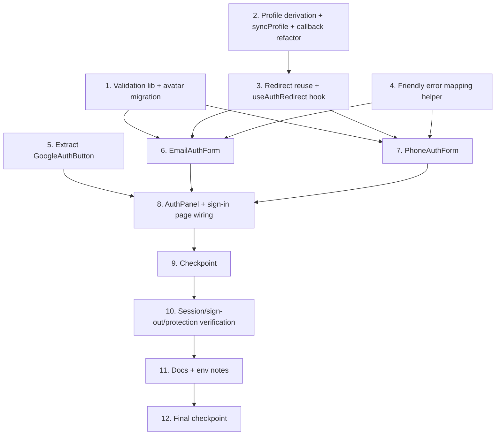

# Implementation Plan: multi-method-auth

## Overview

This plan implements email+password and phone-OTP authentication alongside the existing Google OAuth flow, reusing the project's Supabase client factories, routing helpers, and profile-sync pattern. Work proceeds from shared pure logic (validation, profile derivation) outward to UI components, then wires everything into the existing `/auth/sign-in` page. Property tests live under `src/__tests__/properties/` with Vitest + fast-check. Tasks marked `*` are optional (tests) and are not auto-implemented.

## Task Dependency Graph



```json
{
  "waves": [
    { "wave": 1, "tasks": ["1", "2", "4", "5"] },
    { "wave": 2, "tasks": ["3"] },
    { "wave": 3, "tasks": ["6", "7"] },
    { "wave": 4, "tasks": ["8"] },
    { "wave": 5, "tasks": ["9"] },
    { "wave": 6, "tasks": ["10"] },
    { "wave": 7, "tasks": ["11"] },
    { "wave": 8, "tasks": ["12"] }
  ]
}
```

## Tasks

- [ ] 1. Add shared auth validation library and avatar migration
  - Create `src/lib/auth/validation.ts` with `ValidationResult` union and `validateEmail`, `validatePassword`, `validatePasswordConfirmation`, `validatePhone` (typed, pure, structured results)
  - Document the password policy constants (min length, composition) in the module
  - Add forward migration `supabase/migrations/<timestamp>_profiles_add_avatar_url.sql` with `alter table public.profiles add column if not exists avatar_url text;`
  - _Requirements: 2.2, 2.3, 2.4, 4.2, 7.7, 8.6, 10.3_

  - [ ]* 1.1 Write property test for email validation
    - **Property 1: Email validation accepts well-formed and rejects malformed addresses**
    - **Validates: Requirements 2.3, 8.6, 10.3**

  - [ ]* 1.2 Write property test for password policy validation
    - **Property 2: Password validation enforces the documented policy**
    - **Validates: Requirements 2.4, 8.6, 10.3**

  - [ ]* 1.3 Write property test for password confirmation
    - **Property 3: Password confirmation matches exactly**
    - **Validates: Requirements 2.2, 8.6, 10.3**

  - [ ]* 1.4 Write property test for phone E.164 validation
    - **Property 4: Phone validation accepts only E.164 international format**
    - **Validates: Requirements 4.2, 8.6, 10.3**

- [ ] 2. Implement profile derivation and shared sync
  - [ ] 2.1 Create `src/lib/auth/profile.ts` with `ProfileUpsert` type and pure `deriveProfileFromUser(user)` (id, null-safe email/phone, full_name + avatar_url from metadata, updated_at)
    - _Requirements: 7.1, 7.2, 7.3, 7.4, 7.5, 7.6, 7.7, 7.8_

  - [ ]* 2.2 Write property test for profile derivation
    - **Property 5: Profile derivation is total and null-safe across all user shapes**
    - **Validates: Requirements 7.1, 7.2, 7.3, 7.4, 7.5, 7.6, 7.7, 7.8, 11.3**

  - [ ] 2.3 Create `syncProfile` server action in `src/app/actions/auth-sync.ts` that reads the user via the server client and upserts via the admin client using `deriveProfileFromUser`
    - Return `{ ok: false }` without upserting when no authenticated user is present
    - _Requirements: 7.1, 8.2, 10.1_

  - [ ] 2.4 Refactor `src/app/auth/callback/route.ts` to upsert via `deriveProfileFromUser` (preserve welcome-email behavior and `error=auth_failed` redirect)
    - _Requirements: 1.2, 1.4, 7.1, 10.4_

- [ ] 3. Implement redirect-safety reuse and verify resolver
  - Confirm `EmailAuthForm`/`PhoneAuthForm` will use `resolvePostAuthDestination` from `src/lib/routing.ts` (no new redirect logic); add a `useAuthRedirect` hook in `src/components/auth/useAuthRedirect.ts` that calls `syncProfile()` then navigates to the resolved destination
  - _Requirements: 1.3, 1.5, 6.2, 6.3, 8.4_

  - [ ]* 3.1 Write property test for post-login redirect resolution
    - **Property 6: Post-login redirect resolution is always safe and consistent across methods**
    - **Validates: Requirements 1.3, 1.5, 6.2, 6.3, 8.4, 11.2**

- [ ] 4. Implement the friendly error mapping helper
  - Create `src/lib/auth/errors.ts` with `toFriendlyAuthError(error)` mapping Supabase error shapes to sanitized, user-safe strings (invalid credentials, provider/SMS unavailable, generic fallback) with no raw payloads
  - _Requirements: 2.8, 3.4, 3.5, 4.8, 8.5_

  - [ ]* 4.1 Write unit tests for `toFriendlyAuthError`
    - Assert representative Supabase errors map to sanitized strings and never expose raw payloads
    - _Requirements: 8.5_

- [ ] 5. Extract the Google auth button (preserve existing behavior)
  - Create `src/components/auth/GoogleAuthButton.tsx` containing the existing `signInWithOAuth` Google logic (role, `redirectTo` to `/auth/callback`, `prompt: select_account`, loading/error states) moved verbatim
  - _Requirements: 1.1, 1.3, 1.5, 10.1, 10.4_

  - [ ]* 5.1 Write integration test for Google button
    - Assert `signInWithOAuth` is called with provider `google` and a `redirectTo` targeting `/auth/callback`
    - _Requirements: 1.1_

- [ ] 6. Implement the email auth form
  - Create `src/components/auth/EmailAuthForm.tsx` with login/signup toggle; run `validateEmail`/`validatePassword`/`validatePasswordConfirmation` before any Supabase call; call `supabase.auth.signUp` or `signInWithPassword`; handle the no-session email-confirmation branch; on active session call `useAuthRedirect`; disable only its own submit button while pending; render errors via `toFriendlyAuthError`
  - _Requirements: 2.1, 2.2, 2.3, 2.4, 2.5, 2.6, 2.7, 2.8, 2.9, 3.1, 3.2, 3.3, 3.4, 3.5, 3.6, 5.2, 5.4, 5.5, 8.5_

  - [ ]* 6.1 Write unit tests for the email form
    - Cover pending-state button disable, confirmation-message branch, friendly-error mapping, and login/signup toggle
    - _Requirements: 2.5, 2.6, 2.8, 3.4, 3.6, 5.4_

  - [ ]* 6.2 Write integration tests for email signup/login
    - Assert `signUp`/`signInWithPassword` called with credentials on valid input and navigation occurs on session
    - _Requirements: 2.1, 2.7, 3.1, 3.3_

- [ ] 7. Implement the phone OTP form
  - Create `src/components/auth/PhoneAuthForm.tsx` as a two-step flow; run `validatePhone`; call `supabase.auth.signInWithOtp({ phone })` then advance only on success and show the code-sent success state; call `verifyOtp({ phone, token, type: 'sms' })`; on success call `useAuthRedirect`; allow retry on verify failure; disable only its own active control while pending; render errors via `toFriendlyAuthError`
  - _Requirements: 4.1, 4.2, 4.3, 4.3a, 4.4, 4.5, 4.6, 4.7, 4.8, 5.3, 5.4, 5.6, 8.5_

  - [ ]* 7.1 Write unit tests for the phone form
    - Cover step advance only on send success, success-state visibility, verify-failure retry, provider-error message, and pending-state control disable
    - _Requirements: 4.3, 4.3a, 4.6, 4.7, 4.8, 5.6_

  - [ ]* 7.2 Write integration tests for phone OTP
    - Assert `signInWithOtp` then `verifyOtp({type:'sms'})` are called and session established before navigation
    - _Requirements: 4.1, 4.4, 4.5_

- [ ] 8. Compose the AuthPanel and wire into the sign-in page
  - [ ] 8.1 Create `src/components/auth/AuthPanel.tsx` with tabbed/sectioned Google, Email, and Phone options; own the `customer`/`vendor` role selection and shared error rendering using existing shadcn `Card`/`Button` and Tailwind tokens
    - _Requirements: 5.1, 5.2, 5.3, 5.5, 5.7_

  - [ ] 8.2 Update `src/app/auth/sign-in/page.tsx` to render `<AuthPanel>` while preserving role selection, `redirectedFrom`/`plan`/`mfa-required` query handling, and the existing Suspense wrapper
    - _Requirements: 1.5, 5.1, 6.2, 6.4_

  - [ ]* 8.3 Write unit test for AuthPanel composition
    - Assert all three method sections render and the phone section shows a two-step flow
    - _Requirements: 5.1, 5.3_

- [ ] 9. Checkpoint - Ensure all tests pass
  - Run `npm run test` and `npm run lint`; ensure all property, unit, and integration tests pass, ask the user if questions arise.

- [ ] 10. Verify session, sign-out, and protection consistency
  - [ ] 10.1 Confirm all three flows establish a session readable by the server client and `middleware.ts`, and that `/auth/sign-out` and middleware protection remain intact (no code change expected beyond wiring; adjust only if a gap is found)
    - _Requirements: 6.1, 6.4, 6.5, 6.6, 6.7_

  - [ ]* 10.2 Write tests for sign-out and protected-route redirect
    - Assert `signOut` is called with redirect to `/`, and an unauthenticated Protected_Route request redirects to `/auth/sign-in?redirectedFrom=...` (default-deny)
    - _Requirements: 6.4, 6.5, 6.7_

  - [ ]* 10.3 Write cross-surface session integration test
    - With a mocked session cookie, assert the server client `getUser()` returns the user (reload persistence)
    - _Requirements: 6.1, 6.6_

- [ ] 11. Documentation and environment notes
  - Add a manual test checklist to `docs/` covering Google login, email signup/login, wrong-password clean error, phone OTP request/verify, logout, protected-route redirect, authenticated access, page-refresh persistence, and profile creation for all three methods
  - Document the Supabase dashboard SMS-provider setup for phone OTP and the email-confirmation setting behavior; confirm `.env.example` needs no new auth variables (add with a comment only if a variable proves strictly required)
  - _Requirements: 9.1, 9.2, 9.3, 9.4, 11.4_

- [ ] 12. Final checkpoint - Ensure all tests pass
  - Run `npm run test` and `npm run lint`; ensure all tests pass, ask the user if questions arise.

## Notes

- Tasks marked with `*` are optional test sub-tasks and can be skipped for a faster MVP.
- Each task references specific requirements (granular clauses) for traceability.
- Property tests are placed close to the implementation they validate to catch errors early, and each references its design property number.
- The six property tests map one-to-one to the six Correctness Properties in the design.
- Checkpoints (tasks 9 and 12) provide incremental validation points.
