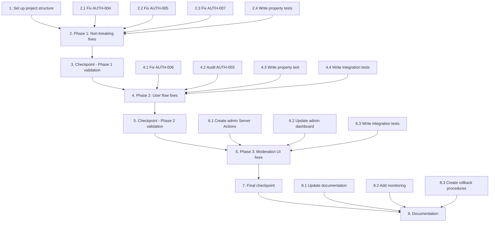

# Implementation Plan: Repository Audit Fix - Batch 2: Auth & Access Control

## Overview

This implementation plan focuses on fixing six authentication and access control issues identified in the Carhire repository audit (AUTH-003 through AUTH-008). The fixes are organized into three implementation phases for safe, incremental deployment:

**Phase 1:** Non-breaking fixes - AUTH-004, AUTH-005, AUTH-007  
**Phase 2:** User flow changes - AUTH-006, AUTH-003 (audit)  
**Phase 3:** UI pattern changes - AUTH-008

**Implementation Language:** TypeScript (Next.js 14+ with Server Actions)

**Prerequisites:** Batch 1 critical security fixes must be deployed first.

## Task Dependency Graph

## Tasks

- [x] 1. Set up project structure for Batch 2 fixes
  - Review existing auth utility files
  - Create new directory for admin Server Actions
  - Set up test framework for property-based testing
  - _Requirements: 3.2, 3.3, 3.4, 3.5, 3.6_

- [x] 2. Phase 1: Non-breaking authentication fixes
  - [x] 2.1 Fix AUTH-004: Remove or fix `userHasMfa()` function
    - Remove the buggy `userHasMfa()` function from `src/lib/security/auth.ts`
    - Ensure `requireAdmin()` continues to use live MFA check via `supabase.auth.mfa.getAuthenticatorAssuranceLevel()`
    - Update any references to the removed function
    - _Requirements: 3.2 (AUTH-004)_

  - [x] 2.2 Fix AUTH-005: Handle OAuth exchange errors in auth callback
    - Add error handling for `exchangeCodeForSession()` in `src/app/auth/callback/route.ts`
    - Redirect to `/auth/sign-in?error=auth_failed` on OAuth exchange failure
    - Log errors for debugging purposes
    - _Requirements: 3.3 (AUTH-005)_

  - [x] 2.3 Fix AUTH-007: Handle RPC errors in chat actions
    - Add error handling for `is_org_member` RPC call in `src/app/actions/chat.ts`
    - Implement fail-secure behavior: on RPC failure, treat user as unauthorized
    - Log RPC errors for monitoring
    - _Requirements: 3.5 (AUTH-007)_

  - [ ]* 2.4 Write property tests for Phase 1 fixes
    - **Property 1: Live MFA Enforcement** - Verify live MFA check vs stale metadata
    - **Property 2: OAuth Error Handling** - Verify error redirection on OAuth failures
    - **Property 3: Secure RPC Error Handling** - Verify fail-secure behavior on RPC failures
    - Use `fast-check` library with 100+ iterations per property
    - **Validates: Requirements 3.2, 3.3, 3.5**

- [ ] 3. Checkpoint - Phase 1 validation
  - Ensure all Phase 1 fixes pass property tests
  - Verify backward compatibility with existing auth flows
  - Test OAuth failure scenarios manually
  - Ask the user if questions arise.

- [ ] 4. Phase 2: User flow and server action fixes
  - [ ] 4.1 Fix AUTH-006: Add organization check to vendor layout
    - Modify `src/app/vendor/layout.tsx` to check for organization membership
    - Redirect users without organization to `/vendor/onboarding`
    - Maintain existing functionality for users with organizations
    - _Requirements: 3.4 (AUTH-006)_

  - [ ] 4.2 Audit and fix AUTH-003: Verify ownership checks in vendor Server Actions
    - Review `src/app/vendor/vehicles/image-actions.ts` for `ensureUserCanManageOrganization()` call
    - Review `src/app/vendor/leads/actions.ts` for ownership verification
    - Verify `src/app/vendor/onboarding/actions.ts` creates new org (no ownership check needed)
    - Confirm `src/app/vendor/vehicles/actions.ts` already has proper checks
    - Confirm `src/app/vendor/branches/actions.ts` already has proper checks
    - Add missing ownership checks where needed
    - _Requirements: 3.1 (AUTH-003)_

  - [ ]* 4.3 Write property test for Phase 2 fix
    - **Property 4: Onboarding Redirection** - Verify redirect for users without organization
    - Generate random user/organization states to test redirection logic
    - **Validates: Requirements 3.4**

  - [ ]* 4.4 Write integration tests for server action ownership verification
    - Create static analysis test to verify Server Actions have ownership checks
    - Test that `createAdminClient()` is never called without prior ownership verification
    - **Validates: Requirements 3.1**

- [ ] 5. Checkpoint - Phase 2 validation
  - Test new vendor onboarding flow with organization redirection
  - Verify all vendor Server Actions have proper ownership checks
  - Run static analysis on Server Actions to confirm security patterns
  - Ask the user if questions arise.

- [ ] 6. Phase 3: Moderation UI security fixes
  - [ ] 6.1 Create admin Server Actions for moderation
    - Create `src/app/actions/admin.ts` with Server Actions for moderation
    - Implement `moderateVendor()`, `moderateListing()`, `moderateReview()` functions
    - Integrate with existing `/api/admin/moderation` API route
    - Add proper error handling and result types
    - _Requirements: 3.6 (AUTH-008)_

  - [ ] 6.2 Update admin dashboard moderation interfaces
    - Replace GET links in `src/app/admin/page.tsx` with Server Action forms
    - Update vendor moderation in `src/app/admin/vendors/page.tsx`
    - Update listing moderation in `src/app/admin/listings/page.tsx`
    - Update review moderation in `src/app/admin/reviews/page.tsx`
    - Add proper loading states and error feedback
    - _Requirements: 3.6 (AUTH-008)_

  - [ ]* 6.3 Write integration tests for moderation security
    - Test that all moderation interfaces use Server Actions not GET links
    - Verify CSRF protection through Next.js Server Actions
    - **Validates: Requirements 3.6**

- [ ] 7. Final checkpoint - Complete Batch 2 validation
  - Run all property tests and unit tests
  - Test end-to-end moderation flows
  - Verify new vendor onboarding experience
  - Check error handling for all authentication scenarios
  - Ensure all tests pass, ask the user if questions arise.

- [ ] 8. Documentation and monitoring setup
  - [ ] 8.1 Update documentation for new vendor onboarding flow
    - Document AUTH-006 redirect behavior for new vendors
    - Update onboarding documentation
    - _Requirements: 3.4_

  - [ ] 8.2 Add monitoring for auth callback errors
    - Set up logging for OAuth exchange failures
    - Create dashboard alert for auth failures
    - _Requirements: 3.3_

  - [ ] 8.3 Create rollback procedures documentation
    - Document individual fix rollback steps
    - Create backup procedures for each modified file
    - Note risk levels for each fix
    - _Requirements: All Batch 2 requirements_

## Notes

- **Task marking:** Tasks marked with `*` are optional test sub-tasks that can be skipped for faster implementation.
- **Property tests:** Required for AUTH-004, AUTH-005, AUTH-006, AUTH-007 as per design correctness properties.
- **Integration tests:** Required for AUTH-003 and AUTH-008 (code pattern verification).
- **Implementation order:** Follows the design's 3-phase approach for safe, incremental deployment.
- **Checkpoints:** Each phase ends with a validation checkpoint to ensure quality.
- **Dependencies:** Batch 1 (critical security fixes) must be deployed before starting Batch 2.
- **Language:** TypeScript with Next.js 14+ Server Actions.

## Security Considerations

1. **Service-role client:** Ensure AUTH-003 fixes prevent unauthorized service-role access
2. **MFA enforcement:** AUTH-004 ensures live MFA checks not stale metadata
3. **OAuth security:** AUTH-005 prevents silent authentication failures
4. **CSRF protection:** AUTH-008 eliminates GET-based moderation vulnerabilities
5. **Fail-secure:** AUTH-007 ensures RPC failures don't grant unauthorized access

## Success Criteria

**Technical Success:**
- [ ] All 6 auth fixes implemented according to design
- [ ] Property tests passing for applicable fixes
- [ ] Integration tests verifying code patterns
- [ ] No regression in existing authentication flows

**Security Success:**
- [ ] No service-role client calls without ownership verification
- [ ] No stale MFA metadata used for authorization
- [ ] No silent OAuth failures
- [ ] No CSRF-vulnerable GET moderation links
- [ ] Fail-secure error handling for all auth failures

**User Experience Success:**
- [ ] New vendors smoothly redirected to onboarding
- [ ] OAuth failures show clear error messages
- [ ] Moderation actions work with proper feedback
- [ ] No broken dashboard for incomplete onboarding