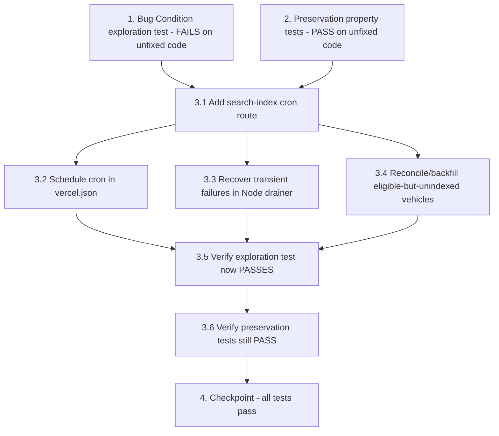

# Implementation Plan

## Overview

This plan fixes the bug where newly listed/approved vehicles are saved to the database but never become reliably discoverable on the search-backed listing surfaces, because nothing ever drains the `search_index_jobs` queue into Typesense. It follows the exploratory bugfix workflow: first write a failing exploration test that proves the bug (Property 1: Bug Condition), then write passing preservation tests that capture existing behavior (Property 2: Preservation), then apply the targeted fix (scheduled cron drain + transient-failure recovery + reconciliation backfill), and finally re-run both property tests to confirm the bug is fixed with no regressions.

## Task Dependency Graph

```json
{
  "waves": [
    {
      "wave": 1,
      "tasks": ["1", "2"],
      "description": "Pre-fix property tests: write and run the Bug Condition exploration test (must FAIL) and the Preservation tests (must PASS) on unfixed code."
    },
    {
      "wave": 2,
      "tasks": ["3.1"],
      "description": "Add the authenticated search-index cron route that drains the queue via processSearchIndexJobs()."
    },
    {
      "wave": 3,
      "tasks": ["3.2", "3.3", "3.4"],
      "description": "Schedule the cron in vercel.json, recover transient failures in the Node drainer, and reconcile/backfill eligible-but-unindexed vehicles."
    },
    {
      "wave": 4,
      "tasks": ["3.5", "3.6"],
      "description": "Re-run the same property tests: exploration test now PASSES, preservation tests still PASS."
    },
    {
      "wave": 5,
      "tasks": ["4"],
      "description": "Checkpoint: run the full suite (exploration, preservation, unit, integration) and ensure everything passes."
    }
  ]
}
```



## Tasks

- [ ] 1. Write bug condition exploration test
  - **Property 1: Bug Condition** - Newly Listed/Approved Vehicles Become Discoverable
  - **CRITICAL**: This test MUST FAIL on unfixed code - failure confirms the bug exists
  - **DO NOT attempt to fix the test or the code when it fails**
  - **NOTE**: This test encodes the expected behavior - it will validate the fix when it passes after implementation
  - **GOAL**: Surface counterexamples that demonstrate the bug exists (eligible vehicle enqueued but never appearing in `searchVehicles`)
  - **Scoped PBT Approach**: Generate random publicly-eligible vehicles (approved vehicle + approved org + approved branch); for the deterministic reported case, scope to a concrete failing example: a Corvette in Sydney under Luxury
  - With Typesense configured (or a stubbed Typesense client), simulate the full listing flow: create/approve an eligible vehicle (which enqueues a `pending` `upsert` job into `search_index_jobs`), WITHOUT running any drainer, then query the listing surfaces
  - Test that for all eligible vehicles `X` satisfying `isBugCondition(X)` (publicly eligible AND not visible in listing surfaces):
    - `searchVehicles("", { city: X.city })` does NOT return `X` (location search, Requirement 2.2)
    - `searchVehicles("", { city: X.city, category: X.category })` does NOT return `X` (category + location browse, Requirement 2.3)
    - The `search_index_jobs` row for `X` stays `pending` and is never transitioned to `complete` (confirms drain never runs)
    - Repeat the assertion for the admin-approval path (approve a pending vehicle via the moderation action) — it stays absent from search
  - The test assertions should match the Expected Behavior in Property 1 (after the fix, `X` SHALL appear in search by location, category+location, and listing surfaces after refresh)
  - Run test on UNFIXED code
  - **EXPECTED OUTCOME**: Test FAILS (this is correct - it proves the bug exists)
  - Document counterexamples found (e.g., "Corvette approved in Sydney/Luxury is present in DB with a pending upsert job, but searchVehicles returns no Corvette for Sydney or Luxury+Sydney") to understand root cause: no scheduled process ever calls `processSearchIndexJobs()` / the `search-index-worker` Edge Function
  - Mark task complete when test is written, run, and failure is documented
  - _Requirements: 1.1, 1.2, 1.3, 1.4, 2.1, 2.2, 2.3, 2.4_

- [ ] 2. Write preservation property tests (BEFORE implementing fix)
  - **Property 2: Preservation** - Unaffected Inputs Behave Identically
  - **IMPORTANT**: Follow observation-first methodology
  - Run the UNFIXED `searchVehicles` for inputs where `isBugCondition(X)` returns false and record actual outputs:
    - Observe search/filter/sort results for vehicles already present in the Typesense index (Requirement 3.1)
    - Observe that non-eligible vehicles (pending/suspended/rejected, or under a non-approved org/branch) are excluded (Requirement 3.2)
    - Observe results for location/category/price/seats/transmission/fuel filters (Requirement 3.3)
    - Observe that a removed/suspended/rejected vehicle's `delete` job drops it from public surfaces (Requirement 3.4)
    - Observe that image, vendor/branch detail, and pricing resolution produce specific values (Requirement 3.5)
    - Observe the DB fallback path when Typesense is unconfigured/erroring
  - Write property-based tests capturing the observed behavior patterns: generate random mixes of eligible/non-eligible vehicles and random filter sets, asserting `searchVehicles` output (and exclusions) matches the recorded baseline
  - Property-based testing generates many vehicle/filter combinations across the input domain for stronger guarantees (mixed statuses, all filter permutations, Typesense-off fallback)
  - Run tests on UNFIXED code
  - **EXPECTED OUTCOME**: Tests PASS (this confirms baseline behavior to preserve)
  - Mark task complete when tests are written, run, and passing on unfixed code
  - _Requirements: 3.1, 3.2, 3.3, 3.4, 3.5_

- [ ] 3. Fix for newly listed/approved vehicles never reaching the search-backed listing surfaces

  - [ ] 3.1 Add a scheduled cron route that drains the search index queue
    - Per AGENTS.md, FIRST confirm the Route Handler conventions in `node_modules/next/dist/docs/` before writing the handler (this Next.js is modified)
    - Create `src/app/api/cron/search-index/route.ts` with a `GET` handler guarded by `CRON_SECRET` (`Authorization: Bearer <CRON_SECRET>`), mirroring `src/app/api/cron/daily-blog/route.ts`, with `export const dynamic = "force-dynamic"` and an appropriate `maxDuration`
    - Call `processSearchIndexJobs(limit)` (looping until no pending jobs remain or a per-invocation cap is hit) and return `{ processed, errors }` as JSON
    - Return 401 without a valid `CRON_SECRET` bearer token and 200 with it
    - _Bug_Condition: isBugCondition(X) = isPubliclyEligible(X) AND NOT isVisibleInListingSurfaces(X) (queued upsert never drained)_
    - _Expected_Behavior: runSearchIndexCron() drains pending jobs so X appears in search by location, category+location, and listing surfaces after refresh (Property 1)_
    - _Preservation: Preservation Requirements from design (searchVehicles query/filter/sort logic, DB fallback, write-path enqueue, schema, image/vendor/pricing resolution unchanged)_
    - _Requirements: 2.1, 2.2, 2.3, 2.4_

  - [ ] 3.2 Schedule the cron in vercel.json
    - Add a frequent cron entry for `/api/cron/search-index` (e.g. `*/2 * * * *` or the smallest interval the deployment plan allows) alongside the existing `daily-blog` cron, so the queue drains within a bounded, predictable time
    - Document the plan-dependent cron granularity
    - _Bug_Condition: isBugCondition(X) — upsert jobs stay pending because nothing runs on a schedule_
    - _Expected_Behavior: X is reflected into listing surfaces within a bounded, predictable time (Requirement 2.4)_
    - _Preservation: Existing daily-blog cron and all other scheduling unchanged_
    - _Requirements: 2.4_

  - [ ] 3.3 Recover transient failures in the Node drainer
    - Extend `processSearchIndexJobs()` in `src/lib/search/typesense.ts` to also pick up retriable `failed` jobs (`attempts < 3` and `next_run_at <= now`) using the same backoff bookkeeping the Edge Function already implements, OR have the cron route invoke the existing `search-index-worker` Edge Function (which already has retry/backoff)
    - Keep the chosen mechanism single-sourced to avoid double-processing
    - _Bug_Condition: isBugCondition(X) — transient Typesense errors leave eligible vehicles unindexed_
    - _Expected_Behavior: Retriable failed jobs are reprocessed so X eventually becomes discoverable (Property 1)_
    - _Preservation: Permanently failed jobs (attempts >= 3) and non-approved vehicles never get indexed (Requirements 3.2, 3.4)_
    - _Requirements: 2.4_

  - [ ] 3.4 Reconcile/backfill already-eligible-but-unindexed vehicles
    - Create a one-off maintenance script under `scripts/` (e.g. `scripts/reconcile-search-index.ts`), mirroring existing maintenance scripts
    - Enqueue `upsert` jobs for every currently approved vehicle (approved org + approved branch) so existing invisible-but-saved vehicles (the reported Corvette) become discoverable once the scheduler runs
    - Enqueue is idempotent because the worker upserts by vehicle id
    - _Bug_Condition: isBugCondition(X) — vehicles approved before the fix have no live mechanism to be (re)indexed_
    - _Expected_Behavior: All currently-eligible vehicles become discoverable after backfill + cron run (Property 1)_
    - _Preservation: Idempotent enqueue does not alter already-indexed vehicles or index non-approved vehicles (Requirements 3.1, 3.2)_
    - _Requirements: 2.1, 2.2, 2.3, 2.4_

  - [ ] 3.5 Verify bug condition exploration test now passes
    - **Property 1: Expected Behavior** - Newly Listed/Approved Vehicles Become Discoverable
    - **IMPORTANT**: Re-run the SAME test from task 1 - do NOT write a new test
    - The test from task 1 encodes the expected behavior
    - When this test passes, it confirms the expected behavior is satisfied: after running the search-index cron, each eligible vehicle appears in search by its city, in its category browsed with its location filter, and on listing surfaces after refresh
    - Run bug condition exploration test from step 1
    - **EXPECTED OUTCOME**: Test PASSES (confirms bug is fixed)
    - _Requirements: 2.1, 2.2, 2.3, 2.4_

  - [ ] 3.6 Verify preservation tests still pass
    - **Property 2: Preservation** - Unaffected Inputs Behave Identically
    - **IMPORTANT**: Re-run the SAME tests from task 2 - do NOT write new tests
    - Run preservation property tests from step 2
    - **EXPECTED OUTCOME**: Tests PASS (confirms no regressions in search/filter/sort, exclusion, removal, image/vendor/pricing resolution, and DB fallback)
    - Confirm all tests still pass after fix (no regressions)
    - _Requirements: 3.1, 3.2, 3.3, 3.4, 3.5_

- [ ] 4. Checkpoint - Ensure all tests pass
  - Run the full test suite: exploration test (now passing), preservation property tests (still passing), unit tests, and integration tests
  - Unit tests: `processSearchIndexJobs()` transitions a pending `upsert` to `complete` and upserts the document; honors `delete` jobs and skips/deletes non-approved vehicles; picks up retriable failed jobs but not permanently failed ones; cron route returns 401 without and 200 with a valid `CRON_SECRET`
  - Integration tests: full list/approve → run cron → discoverable by location and category+location and persists after refresh; backfill flow; lifecycle approve→reindex→visible, suspend/delete→reindex→hidden
  - Ensure all tests pass, ask the user if questions arise

## Notes

- Tasks 1 and 2 are STANDALONE property tests written and run BEFORE the fix: task 1 (Property 1: Bug Condition) MUST FAIL on unfixed code to prove the bug; task 2 (Property 2: Preservation) MUST PASS on unfixed code to capture baseline behavior.
- Do not attempt to fix the code when the task 1 test fails — the failure is the expected, desired outcome that confirms the bug.
- Tasks 3.5 and 3.6 re-run the SAME tests from tasks 1 and 2 respectively; do not author new tests for them.
- Per AGENTS.md, this Next.js is modified — confirm Route Handler conventions in `node_modules/next/dist/docs/` before writing the cron route in task 3.1.
- The fix is intentionally minimal: it adds a scheduled drain, transient-failure recovery, and a one-time backfill. It explicitly does NOT change `searchVehicles()` query/filter/sort logic, the DB fallback, write-path enqueue logic, the Typesense schema, or image/vendor/pricing resolution.
- The cron interval in task 3.2 is plan-dependent; choose the smallest interval the deployment plan allows to satisfy the bounded-time requirement (2.4).
