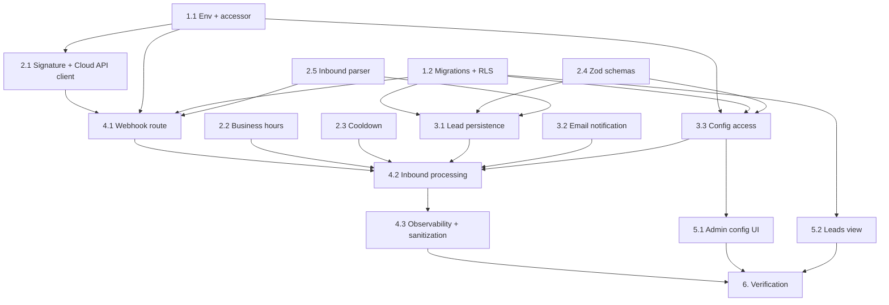

# Implementation Plan

## Overview

This plan implements a Meta WhatsApp Business Cloud API auto-responder: a signed inbound webhook, instant acknowledgement with business-hours/away routing and cooldown, idempotent lead capture into Supabase, recipient email notification, and an admin config page. Pure logic modules (signature, business hours, cooldown, schemas, parser) are built and unit-tested first, then persistence/notification/config, then the route handler wiring, then the admin UI, then verification.

## Tasks

- [x] 1. Environment, config helpers, and database migrations
- [x] 1.1 Add WhatsApp environment variables and accessor
  - Create `src/lib/whatsapp/env.ts` with `getWhatsAppEnv()` reading `WHATSAPP_ACCESS_TOKEN`, `WHATSAPP_PHONE_NUMBER_ID`, `WHATSAPP_WABA_ID`, `WHATSAPP_WEBHOOK_VERIFY_TOKEN`, `WHATSAPP_APP_SECRET`, and optional `WHATSAPP_API_VERSION` (default `v21.0`) via existing `requireEnv`/`optionalEnv` from `src/lib/config.ts`
  - Throw a named error listing any missing required variable; never log secret values
  - Document every new variable with non-secret placeholders and purpose comments in `.env.example`
  - _Requirements: 8.1, 8.2, 8.3, 8.4, 8.5_

- [x] 1.2 Create database migrations for WhatsApp tables and RLS
  - Add SQL migration creating `whatsapp_auto_responder_config` (single-row), `whatsapp_conversations`, `whatsapp_leads`, and `whatsapp_webhook_events` per the design data models
  - Enable RLS on `whatsapp_leads`: admin full-read policy and vendor read policy scoped by `vendor_id` to the requesting org (match existing `leads` table policy pattern); restrict config and webhook-events tables to admin/service-role
  - Seed a default `whatsapp_auto_responder_config` row
  - _Requirements: 4.5, 7.4_

- [x] 2. Pure logic modules with unit tests
- [x] 2.1 Implement signature verification and Cloud API client
  - Create `src/lib/whatsapp/cloud-api.ts` with `verifyMetaSignature(rawBody, signatureHeader)` using HMAC-SHA256 and `crypto.timingSafeEqual`
  - Add `sendCloudApiText` and `sendCloudApiTemplate` returning a structured `SendMessageResult` (never throwing), posting to the Graph API with the access token; reuse `normaliseWhatsAppNumber` for `to`
  - Write `src/lib/whatsapp/cloud-api.test.ts` covering valid, invalid, and missing signatures
  - _Requirements: 1.3, 1.4, 6.1, 6.2, 6.5, 10.1_

- [x] 2.2 Implement business-hours selection
  - Create `src/lib/whatsapp/business-hours.ts` with `selectReplyVariant(now, hours)` and `describeNextOpen(now, hours)` using `Intl.DateTimeFormat` with the configured IANA timezone
  - Unconfigured/null weekday yields `away`; handle DST correctly via `Intl`
  - Write `src/lib/whatsapp/business-hours.test.ts` covering in-hours, out-of-hours, unconfigured weekday, and a DST boundary for `Australia/Sydney`
  - _Requirements: 3.1, 3.2, 3.3, 3.4, 3.5, 3.6, 10.2_

- [x] 2.3 Implement acknowledgement cooldown
  - Create `src/lib/whatsapp/cooldown.ts` with `shouldAcknowledge(phone, cooldownMs)` using Redis `SET NX PX` and an in-memory fallback mirroring `rate-limit-redis.ts`
  - Write `src/lib/whatsapp/cooldown.test.ts` covering first message, repeat within window, and after-window cases (in-memory fallback path)
  - _Requirements: 2.3, 10.3_

- [x] 2.4 Add Zod schemas for inbound messages and config
  - Add `whatsappInboundSchema` and `autoResponderConfigSchema` (with `dayHoursSchema`, timezone refinement, close>open refinement) to `src/lib/validation/schemas.ts`
  - Extend `src/lib/validation/schemas.test.ts` with valid/invalid cases for both schemas
  - _Requirements: 4.4, 7.3, 10.4_

- [x] 2.5 Implement inbound webhook payload parser
  - Create `src/lib/whatsapp/inbound.ts` with `parseWebhookPayload` returning typed messages and statuses, tolerant of shape mismatches (never throws), extracting referral/context vehicle/vendor associations
  - Write `src/lib/whatsapp/inbound.test.ts` including a duplicate-message-id idempotency case around the claim logic
  - _Requirements: 1.6, 4.3, 10.5_

- [x] 3. Persistence, notification, and config access
- [x] 3.1 Implement WhatsApp lead persistence
  - Create `src/lib/whatsapp/leads.ts` with `persistWhatsAppLead(msg, variant)` validating via `whatsappInboundSchema`, upserting `whatsapp_conversations` by phone, inserting `whatsapp_leads`, resolving vendor/vehicle from referral, using `createAdminClient()`
  - _Requirements: 4.1, 4.2, 4.3, 4.4_

- [x] 3.2 Add WhatsApp lead email notification
  - Extend `src/lib/email/resend.ts` with `sendWhatsAppLeadAlert` (no-op when Resend unconfigured) plus a retry wrapper with configurable max attempts; record final delivery status on the lead
  - _Requirements: 5.3, 5.5_

- [x] 3.3 Implement auto-responder config access
  - Create `src/lib/whatsapp/config.ts` with `getAutoResponderConfig()` (typed defaults when no row) and `updateAutoResponderConfig(patch, adminId)` validating with `autoResponderConfigSchema`, writing the row, and inserting an `audit_logs` entry
  - _Requirements: 7.3, 7.4, 7.6_

- [x] 4. Webhook route handler and inbound processing
- [x] 4.1 Implement the webhook Route Handler
  - Consult `node_modules/next/dist/docs/` for Next.js 16 App Router Route Handler conventions before writing
  - Create `src/app/api/whatsapp/webhook/route.ts` with `GET` (verify-token handshake → challenge/200 or 403) and `POST` (raw body, max-size 413, Redis rate limit 429, HMAC 401, idempotency claim in `whatsapp_webhook_events`, fast 200)
  - _Requirements: 1.1, 1.2, 1.3, 1.4, 1.5, 1.7, 1.8, 9.4_

- [x] 4.2 Implement inbound message processing orchestration
  - Add `processInboundMessage` wiring config → lead persistence → variant selection → cooldown → acknowledgement send → recipient routing/notification; determine recipient (vendor or routing default), open/close window tracking, and record outcomes
  - Ensure lead is always persisted regardless of send/notify result; return 200 even on internal failure after recording
  - _Requirements: 2.1, 2.2, 2.4, 2.5, 4.6, 5.1, 5.2, 5.4, 6.3, 6.4, 9.3, 9.5_

- [x] 4.3 Add observability and input sanitization
  - Report Cloud API and processing errors to Sentry excluding secrets and full message bodies; emit structured log entry per processed message; sanitize untrusted message content before persistence/render/email
  - _Requirements: 9.1, 9.2, 9.5_

- [x] 5. Admin configuration UI
- [x] 5.1 Build the admin auto-responder page and server action
  - Create `src/app/admin/whatsapp/page.tsx` guarded by `requireAdmin()` with a Design System form for enabled flag, cooldown, in-hours/away messages, per-weekday hours, timezone, and routing default; show read-only connection status (phone number id only, never the token)
  - Wire the server action to `updateAutoResponderConfig` with Zod validation and inline field errors
  - _Requirements: 7.1, 7.2, 7.3, 7.4, 7.5, 7.6_

- [x] 5.2 Surface WhatsApp leads in the existing leads view
  - Display `whatsapp_leads` alongside enquiry leads with a WhatsApp channel indicator, respecting RLS so vendors see only their routed leads and admins see all
  - _Requirements: 4.5, 5.4_

- [x] 6. Verification
  - Run `eslint`, `tsc --noEmit` (via `next build`), and `vitest run`; fix any failures so the full suite passes and the build succeeds without regressions
  - _Requirements: 10.6_

## Task Dependency Graph



```json
{
  "waves": [
    { "wave": 1, "tasks": ["1.1", "1.2", "2.2", "2.3", "2.4"] },
    { "wave": 2, "tasks": ["2.1", "2.5", "3.2"] },
    { "wave": 3, "tasks": ["3.1", "3.3"] },
    { "wave": 4, "tasks": ["4.1", "5.1", "5.2"] },
    { "wave": 5, "tasks": ["4.2"] },
    { "wave": 6, "tasks": ["4.3"] },
    { "wave": 7, "tasks": ["6"] }
  ]
}
```

## Notes

- Build the pure logic modules (Task 2) and their unit tests before wiring (Tasks 3-4); they have no external dependencies and de-risk the integration.
- The webhook handler intentionally mirrors `src/app/api/stripe/webhook/route.ts` for signature verification, idempotency, and fast-200 semantics.
- Per the workspace rule, consult `node_modules/next/dist/docs/` for Next.js 16 Route Handler conventions before authoring Task 4.1.
- Recipient notification uses the existing Resend email path; WhatsApp outbound templates (`sendCloudApiTemplate`) are scaffolded but reserved for a later phase.
- Secrets are accessed only via `getWhatsAppEnv()` and must never be logged or surfaced in the admin UI.
